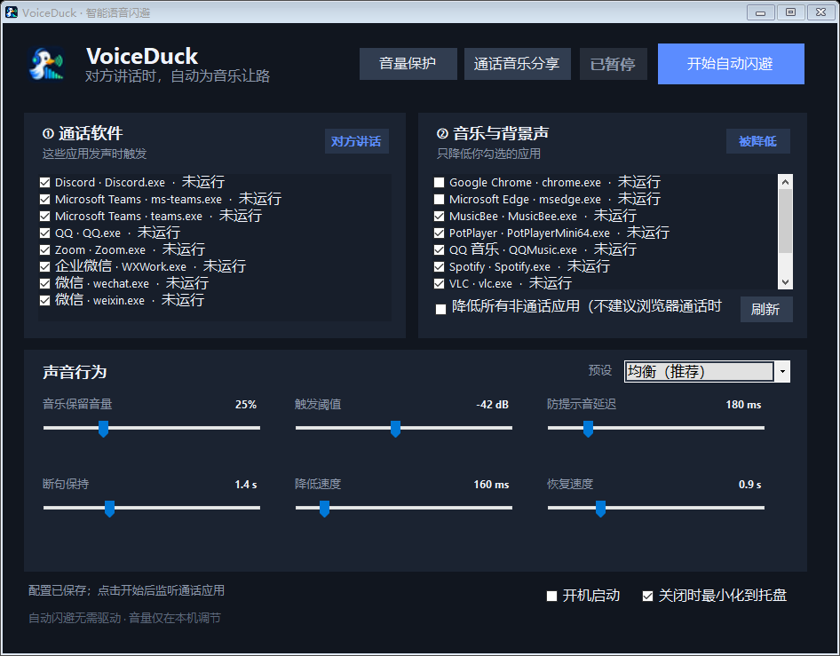

# VoiceDuck

> 微信、QQ 或其他通话软件里有人说话时自动降低音乐；也可以把你的麦克风和本地音乐一起发给对方。

[](https://github.com/1917360964/VoiceDuck/actions/workflows/build.yml)
[](LICENSE)
[](#系统要求)



VoiceDuck 是一个轻量的 Windows 音频闪避与通话音乐分享工具。自动闪避读取通话应用的实时输出电平，只在对方实际发声时降低选定的音乐应用；这部分不需要驱动或管理员权限。通话音乐分享使用 VoiceDuck 内置播放器和一组 VB-CABLE，把“麦克风＋音乐”作为一个虚拟麦克风提供给微信、QQ 等软件。

## 主要特点

- **按应用自动闪避**：微信、QQ 等作为触发端，网易云音乐、QQ 音乐、Spotify 等作为被降低端。
- **过滤短提示音**：声音持续一小段时间后才触发，减少消息提示音误动作。
- **自然断句保持**：跨过人声中的短暂停顿，音乐不会在字词之间频繁起伏。
- **保留原音量比例**：恢复后仍回到用户原先设置的音量。
- **多设备与多会话**：处理所有活动输出设备以及同一进程创建的多个会话。
- **麦克风与音乐一起发送**：对方听到混合信号，你的耳机只播放音乐，不会出现麦克风延迟回听。
- **不回传对方声音**：通话输出始终走真实耳机，VoiceDuck 不抓取整台电脑的扬声器混音。
- **单组虚拟设备**：只安装一对 `CABLE Input` / `CABLE Output`，不会像大型虚拟调音台那样增加大量端点。
- **安全安装与回滚**：驱动只在明确确认后安装；先校验 SHA-256 与发布者签名。检测到正在通话时会显示预计耗时和中断风险，并默认选择“否”。
- **托盘常驻与开机启动**：适合长期后台运行。

## 下载与自动闪避

从 [Releases](https://github.com/1917360964/VoiceDuck/releases) 下载最新便携版，完整解压后运行 `VoiceDuck.exe`。

1. 让通话软件和音乐软件各播放一次声音。
2. 点击“刷新”，左侧勾选通话应用，右侧勾选要降低的音乐应用。
3. 点击“开始自动闪避”；第一次建议使用“均衡（推荐）”。
4. 提示音仍会触发时提高“防提示音延迟”；较轻人声无法触发时降低阈值。

关闭主窗口默认会最小化到托盘。要完全退出，请右键托盘图标并选择“退出并恢复音量”。

## 把本机音乐发给对方

第一次使用需要安装包内置的标准 VB-CABLE 驱动。它由 VB-Audio 签名并以 donationware 方式发布；VoiceDuck 保持官方压缩包原样内置，不需要本项目维护者自行签名内核驱动。

1. 先结束当前通话并退出微信、QQ 等通话应用。
2. 打开“通话音乐分享”，点击“安装内置驱动”，同意 Windows 管理员授权。
3. 按提示手动重启 Windows。VoiceDuck 不会自动重启，也不会修改系统默认麦克风或扬声器。
4. 在微信/QQ 的音频设置中，把输入设备选择为 `CABLE Output (VB-Audio Virtual Cable)`；输出设备仍选择真实耳机。
5. 在 VoiceDuck 选择真实麦克风、真实耳机和本地音乐文件，确认路由后点击“开始分享”。

播放期间可以分别调整麦克风和音乐音量。暂停音乐不会切断麦克风；停止分享后微信/QQ 可继续保留该输入设置，下次直接使用。

### 为什么不会产生回声

```text
本地音乐文件 ─┬─► 真实耳机（只有音乐）
              └─► 音乐增益 ─┐
物理麦克风 ─────► 麦克风增益 ├─► 限幅 ─► CABLE Input ─► CABLE Output ─► 微信/QQ 输入
                            │
微信/QQ 输出 ───────────────────────────────► 真实耳机（从不进入上面的混音）
```

Windows 10 没有可供普通桌面程序稳定使用的“只抓某一个音乐软件、排除通话软件”接口。抓整个系统扬声器会把对方声音送回去形成回声，因此 VoiceDuck 在 Windows 10/11 都优先使用自己的本地播放器，保证音频边界清楚。更多说明见 [虚拟音频设计](docs/VIRTUAL_AUDIO.md)。

## 常用预设

| 预设 | 适合场景 | 特点 |
| --- | --- | --- |
| 均衡 | 日常微信、QQ 通话 | 响应速度与自然度平衡 |
| 游戏语音 | 游戏内语音、Discord | 降低更快、恢复更利落 |
| 会议专注 | Teams、Zoom 长时间会议 | 背景压得更低，断句保持更长 |
| 柔和音乐 | 轻音乐、播客背景 | 音量变化更缓和 |

## 隐私

VoiceDuck 不录音、不保存麦克风或音乐内容，也不主动连接网络。自动闪避只读取 Windows 提供的会话峰值、进程名和音量。音乐分享期间，程序在内存中实时读取所选麦克风与本地音乐文件，将混音送到虚拟麦克风，并把音乐单独送到真实耳机；PCM 数据不会写入磁盘或上传。

驱动安装是明确的用户操作，会触发 Windows UAC。安装前解压出的临时文件在安装程序退出后删除。

## 已知限制

- 微信和 QQ 没有向第三方提供“远端用户正在说话”的公开接口，自动闪避根据应用输出电平判断。
- 浏览器可能同时承载音乐与网页通话；同一浏览器被同时选为触发端和目标端时，VoiceDuck 优先保护通话，不降低它。
- 通话软件没有统一的第三方音频设置接口，因此 `CABLE Output` 需要在每个通话软件里首次选择一次。
- 内置播放器依赖 Windows Media Foundation 解码器；少数特殊编码文件可能无法打开，可先转换成常规 MP3 或 WAV。
- 驱动安装或卸载后 Windows 可能要求重启。为保护正在进行的通话，VoiceDuck 不会自动重启。

## 从源码构建

仓库已经固定并包含构建所需的 NAudio 2.3.0 DLL 与未修改的 VB-CABLE 官方压缩包，不需要在构建时下载依赖：

```powershell
.\scripts\build.ps1
```

构建脚本会编译主程序，运行核心逻辑、音频会话冒烟、内置驱动包哈希与 Authenticode 验证，并编译界面渲染测试。生成发布包：

```powershell
.\scripts\package-release.ps1 -Version 1.1.0
```

也可以使用 Visual Studio 2022 打开 `VoiceDuck.sln`。

## 系统要求

- Windows 10 或 Windows 11 x64
- .NET Framework 4.8
- Windows Media Foundation 可解码所选音乐文件
- 与通话应用运行在同一个 Windows 用户会话中
- 音乐分享首次使用需要安装内置 VB-CABLE 并重启一次；自动闪避不需要它

## 参与维护

欢迎提交问题和改进。开始前请阅读 [贡献指南](CONTRIBUTING.md)。版本变化记录在 [CHANGELOG](CHANGELOG.md)。

## 许可证

VoiceDuck 源代码使用 [MIT License](LICENSE)。NAudio 使用 MIT License。VB-CABLE 是 VB-Audio 的 donationware，按其许可说明以未修改的官方包分发；来源、校验值和完整说明见 [第三方组件说明](THIRD_PARTY_NOTICES.md)。
